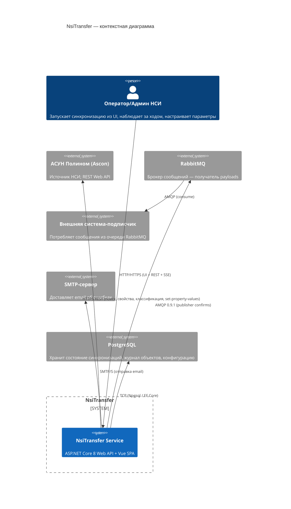
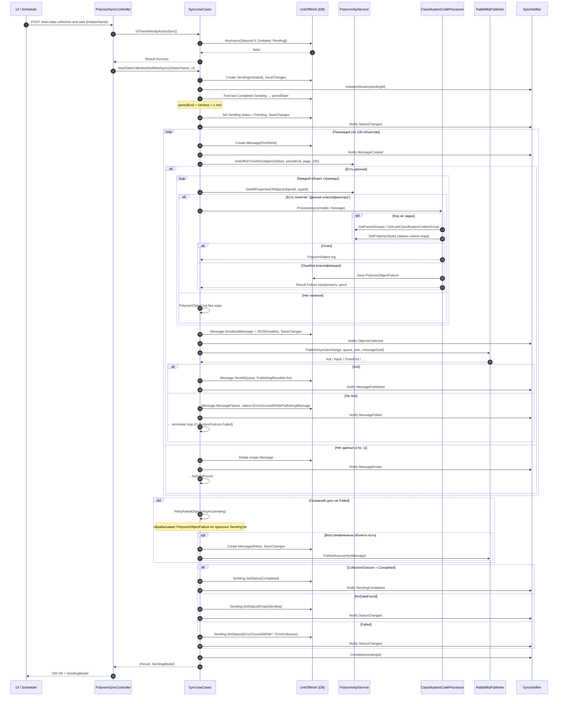
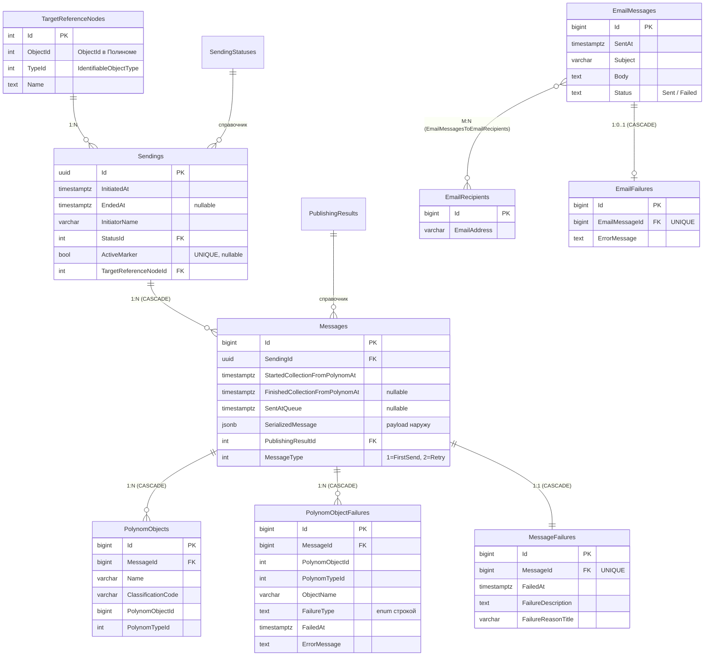
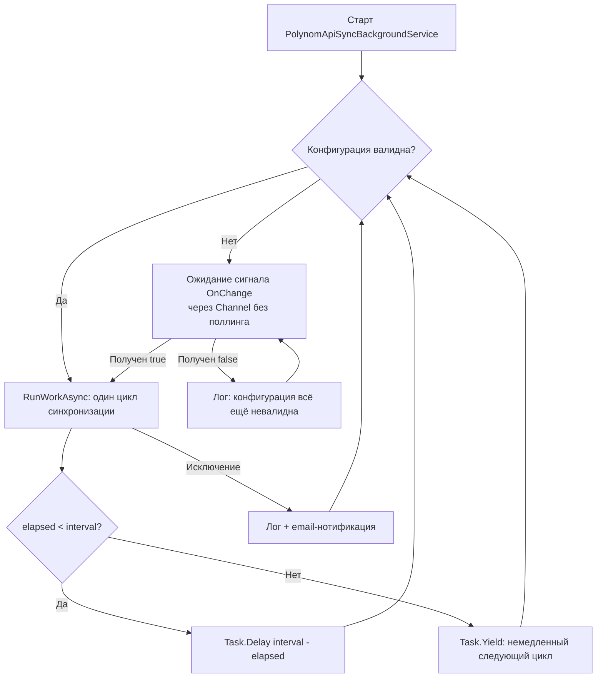

# Сервис синхронизации НСИ (NsiTransfer) — Частное техническое задание (Драфт)

> **Статус документа:** черновик (dra­ft). Подготовлен по результатам реверс-инжиниринга существующей реализации. Места, требующие решений аналитика/архитектора, помечены `[TODO: Аналитик]`.
>
> **Связанные приложения:**
> - [`attachments/db-schema.sql`](attachments/db-schema.sql) — физическая DDL-схема PostgreSQL.
> - [`attachments/api-examples.http`](attachments/api-examples.http) — документированные HTTP-запросы к сервису.

---

## Оглавление

1. [Назначение и границы системы](#1-назначение-и-границы-системы)
2. [Контекст и внешние системы](#2-контекст-и-внешние-системы)
3. [Бизнес-сценарии (Use Cases)](#3-бизнес-сценарии-use-cases)
4. [Последовательность работы синхронизации](#4-последовательность-работы-синхронизации)
5. [Структура базы данных](#5-структура-базы-данных)
6. [Структура данных наружу (RabbitMQ)](#6-структура-данных-наружу-rabbitmq)
7. [HTTP API сервиса](#7-http-api-сервиса)
8. [Взаимодействие с API Полинома](#8-взаимодействие-с-api-полинома)
9. [Файлы настроек и конфигурация](#9-файлы-настроек-и-конфигурация)
10. [Расписание и фоновые сервисы](#10-расписание-и-фоновые-сервисы)
11. [Обработка ошибок и устойчивость](#11-обработка-ошибок-и-устойчивость)
12. [Аутентификация и безопасность](#12-аутентификация-и-безопасность)
13. [Логирование и наблюдаемость](#13-логирование-и-наблюдаемость)
14. [Развёртывание](#14-развёртывание)
15. [Ограничения и допущения](#15-ограничения-и-допущения)
16. [Открытые вопросы для аналитика](#16-открытые-вопросы-для-аналитика)

---

## 1. Назначение и границы системы

### 1.1. Назначение

**NsiTransfer** — интеграционный сервис, обеспечивающий однонаправленную (из **АСУН Полином** во внешнюю систему-потребитель) синхронизацию нормативно-справочной информации (НСИ). Сервис является прослойкой между REST API Полинома и брокером сообщений RabbitMQ, в который публикуются сформированные пачки объектов справочника с их свойствами.

**Ключевые функции:**

1. **Сбор изменений** объектов выбранного справочника Полинома за временной период.
2. **Обогащение** объектов: автоматическое вычисление и присвоение значения свойства «Код классификатора» (через родительские группы и диапазон min/max) с записью обновлённого значения обратно в Полином.
3. **Группировка** собранных объектов в сообщения (Message) и их **публикация** в очередь RabbitMQ с гарантиями доставки (publisher confirms, persistent, mandatory).
4. **Управление конфигурацией** через UI/REST: целевой узел классификации, имена очередей, параметры ретраев, параметры синхронизации, получатели ошибочных email-уведомлений.
5. **Управление сессией пользователя** (прокси к Полиному) с хранением токенов в HttpOnly cookies.
6. **Наблюдение** за процессом синхронизации в реальном времени через Server-Sent Events (SSE).
7. **Уведомление** об ошибках по электронной почте.

### 1.2. Глоссарий

| Термин | Определение |
|---|---|
| **Полином (Polynom)** | Внешняя система АСУН Полином (Ascon), источник НСИ. Доступ — через REST Web API. |
| **Sending (Отправление)** | Один цикл синхронизации: от инициации до терминального статуса. Содержит 1..N сообщений. Идентифицируется GUID. |
| **Message (Сообщение)** | Пачка объектов Полинома, опубликованных в RabbitMQ одним `BasicPublish`. Содержит `SerializedMessage` (jsonb) — фактический payload наружу. |
| **PolynomObject** | Запись об успешно собранном объекте Полинома в рамках конкретного Message (журнальная запись). |
| **PolynomObjectFailure** | Запись об объекте, для которого не удалось вычислить код классификатора. Подлежит ретраю на следующих Sending'ах. |
| **TargetReferenceNode (Целевой узел)** | Узел дерева классификации Полинома, в области которого осуществляется поиск объектов (область синхронизации). |
| **ClassificationCode** | Строковое значение свойства «Код классификатора» объекта (например, `1.2.3` или `0001`). Вычисляется инкрементом от максимального в группе. |
| **ActiveMarker** | Булев маркер активности Sending. `true` — синхронизация активна; `NULL` — завершена. Уникальный индекс гарантирует единственную активную запись в БД. |
| **Publisher confirm** | Режим подтверждения RabbitMQ: брокер возвращает Ack/Nack после успешной записи сообщения. |
| **SSE** | Server-Sent Events — однонаправленный стрим событий от сервера к клиенту по HTTP. |

### 1.3. Что НЕ делает сервис

- Сервис **не** реализует обратную синхронизацию (из внешней системы в Полином), кроме присвоения кода классификатора.
- Сервис **не** хранит полную модель данных Полинома — только журнальные записи об успешных/проваленных объектах и сериализованный payload наружу.
- Сервис **не** выполняет шифрование секретов в `appsettings.json`/`configuration.json` — секреты должны передаваться через переменные окружения (см. [§9](#9-файлы-настроек-и-конфигурация)).
- Сервис **не** предоставляет CRUD по объектам Полинома — только поиск (через утилитарные endpoint'ы), сбор свойств и обновление значения кода классификатора.

---

## 2. Контекст и внешние системы

### 2.1. Диаграмма контекста (C4, Level 1)



### 2.2. Внешние системы — точка интеграции

| Система | Протокол | Назначение | Куда |
|---|---|---|---|
| Полином | HTTPS REST (JSON) | Источник данных НСИ, приём обновлений кода классификатора | Outbound |
| PostgreSQL | TCP (Npgsql) | Хранение состояния (синхронизации, сообщения, журнал объектов, конфигурация) | Локальная |
| RabbitMQ | AMQP 0.9.1 over TCP | Публикация payloads наружу (publisher confirms, persistent, mandatory) | Outbound |
| SMTP-сервер | SMTP/S | Email-нотификация об ошибках операторам | Outbound |
| Браузер пользователя | HTTP/HTTPS | UI (Vue 3 SPA), REST, SSE | Inbound |

### 2.3. Роли пользователей

`[TODO: Аналитик — уточнить и зафиксировать матрицу ролей и прав]`

Текущая реализация различает только аутентифицированных и неаутентифицированных пользователей (`[Authorize]` без политик). Уровней авторизации (ролей) нет. Любой аутентифицированный пользователь может запускать синхронизацию, изменять конфигурацию и читать состояние.

---

## 3. Бизнес-сценарии (Use Cases)

> Формат каждого UC: актор, триггер, предусловия, основной поток, альтернативы/исключения, постусловие. Идентификаторы объектов кода приведены как `ИмяКласса.ИмяМетода`.

### UC-1. Периодическая автоматическая синхронизация

| Поле | Значение |
|---|---|
| **Актор** | Планировщик (`PolynomApiSyncBackgroundService`) |
| **Триггер** | Таймер с интервалом `PolynomApiSyncOptions.StartSyncWithIntervalMinutes` (по умолчанию 15 минут). |
| **Предусловия** | 1. Планировщик активирован в `Program.cs`.<br>2. Файл `AppConfig/configuration.json` существует и прошёл валидацию (`AppConfigurationValidator`).<br>3. RabbitMQ, PostgreSQL, API Полинома доступны. |
| **Основной поток** | 1. Планировщик проверяет отсутствие активной Sending.<br>2. Создаёт Sending со статусом `Initiated`.<br>3. Вызывает `SyncUseCases.StartDataCollectionAndWaitAsync("Фоновый сервис", ct)`.<br>4. После завершения задержка на `(интервал − elapsed)`; если elapsed ≥ интервал — следующая итерация немедленно. |
| **Исключения** | • Конфигурация невалидна → ожидание сигнала `OnChange` (без поллинга).<br>• Запущена другая синхронизация → запись в лог + пропуск итерации.<br>• Критическая ошибка → запись статуса `ErrorUnknown`, email-нотификация, продолжение по таймеру. |
| **Постусловие** | Создана запись Sending с терминальным статусом (`Completed` / `EmptySending` / `Error*`). |

> ⚠️ **Важно:** в текущей поставке `Program.cs` содержит закомментированную регистрацию `PolynomApiSyncBackgroundService` (см. [§15](#15-ограничения-и-допущения)). По умолчанию автосинхронизация **отключена** — работает только ручной запуск.

### UC-2. Ручной запуск синхронизации из UI

| Поле | Значение |
|---|---|
| **Актор** | Оператор НСИ через браузер |
| **Триггер** | Нажатие кнопки «Синхронизировать» в UI (SyncView.vue). |
| **Предусловия** | Пользователь аутентифицирован. Конфигурация валидна. |
| **Основной поток** | 1. UI вызывает `POST /api/polynom-sync/start-data-collection-and-wait` с телом `{ initiatorName: "<логин пользователя>" }`.<br>2. Сервис создаёт Sending, инициализирует SSE-канал, выполняет полный цикл сбора и публикации (см. [§4](#4-последовательность-работы-синхронизации)).<br>3. UI параллельно открывает `GET /api/polynom-sync/listen-for-sync-events?sendingId=...` и отображает прогресс.<br>4. После терминального статуса UI показывает результат и обновляет список отправлений. |
| **Альтернатива A** | Фоновый режим: `POST /api/polynom-sync/start-data-collection-in-background` — Sending создаётся немедленно, обработка ставится в очередь `SyncTaskQueue`. UI получает `SendingModel` сразу, далее следит через SSE. |
| **Исключения** | • Уже есть активная Sending → `409 Conflict` (ProblemDetails). UI показывает сообщение.<br>• Ошибка сбора/публикации → `500` с ProblemDetails, включающим сериализованную `SendingModel` в `detail`. |
| **Постусловие** | Создана Sending; UI получил финальный статус. |

### UC-3. Повторная обработка объектов с ошибкой классификации (Retry)

| Поле | Значение |
|---|---|
| **Актор** | Внутренний — `SyncUseCases.RetryFailedObjectsAsync` |
| **Триггер** | Завершение основного цикла `CollectObjectsAndSend` без критической ошибки. |
| **Предусловия** | В БД существуют записи `PolynomObjectFailure`, сгенерированные предыдущими Sending'ами, и эти объекты не были успешно отправлены в текущем Sending. |
| **Основной поток** | 1. Формируется множество `(PolynomObjectId, PolynomTypeId)` уже собранных объектов текущей Sending.<br>2. Запрашиваются все `PolynomObjectFailure` из других Sending'ов.<br>3. Дедупликация + исключение уже отправленных.<br>4. Создаётся отдельный `Message` с `MessageType = Retry`.<br>5. Для каждого кандидата: повторный сбор свойств → повторная классификация.<br>6. При успехе — старая запись `PolynomObjectFailure` удаляется, объект добавляется в Message.<br>7. Message публикуется в RabbitMQ как обычное сообщение. |
| **Альтернатива** | Если ни один объект не восстановлен — отправляется SSE-событие `RetryMessageEmpty`, Message остаётся пустым (но сохраняется в БД как свидетельство попытки). |
| **Постусловие** | Журнал `PolynomObjectFailures` очищен от успешно восстановленных объектов; внешняя система получила их через RabbitMQ. |

### UC-4. Вычисление и присвоение кода классификатора новому объекту

| Поле | Значение |
|---|---|
| **Актор** | Внутренний — `ClassificationCodeProcessor.ProcessAsync` |
| **Триггер** | В основном цикле собран объект, у которого есть понятие «Данные классификатора» (имя из `ConceptNameForClassificationData`), но свойство «Код классификатора» (`ClassificationCodePropertyName`) не заполнено. |
| **Предусловия** | Объект включён в одну (или несколько) родительских групп; у корректной группы есть свойства min/max. |
| **Основной поток** | 1. Поиск свойства в понятии объекта.<br>2. Если значение уже есть — формирование журнальной записи без модификации.<br>3. Если значения нет — запрос родительских групп через API Полинома.<br>4. Выбор корректной группы (по наличию min/max).<br>5. Запрос максимального существующего кода среди дочерних объектов группы (`GetLastClassificationCodeInGroup`).<br>6. Вычисление нового кода = `lastCode.Increment()` (или `minValue`, если данных нет).<br>7. Проверка `newCode ≤ maxValue`.<br>8. Установка значения свойства в замапленную модель (уйдёт в RabbitMQ) и **обратно в Полином** через `SetPropertyValues` API. |
| **Исключения** (классифицируются в `PolynomObjectFailureTypeEnum`) | • `CannotFindPropertyClassificationCode` — нет свойства.<br>• `NoGroupsAtAll` — ни одной группы.<br>• `MultipleGroupsWithMinMax` — несколько групп с min/max, невозможно выбрать.<br>• `NoGroupsWithMinMax` — группы есть, но ни у одной нет min/max.<br>• `GroupWithoutMinMax` — единственная группа без min/max.<br>• `ErrorWhileProcessWasExecuting` — сбой вызова API Полинома.<br>При любой ошибке создаётся/обновляется запись в `PolynomObjectFailures`. |
| **Постусловие** | Либо объект получает код (и отправляется в RabbitMQ с уже проставленным значением), либо логируется ошибка и объект исключается из текущей публикации (но остался в Полиноме без изменений). |

### UC-5. Аутентификация пользователя

| Поле | Значение |
|---|---|
| **Актор** | Неаутентифицированный пользователь |
| **Триггер** | Ввод логина/пароля на странице `/login` (LoginView.vue). |
| **Основной поток** | 1. UI вызывает `POST /api/auth/signin` с телом `{ login, password }`.<br>2. `AuthController` → `PolynomAuthHttpRepository.SignInAsync`: получает список хранилищ, находит нужное по `PolynomConfig.DbName`, отправляет `POST /api/v1/login/sign-in` в Полином.<br>3. При успехе — получает пару `AccessToken` / `RefreshToken` и `ExpiresIn`.<br>4. Параллельно запрашивает `GET /api/v1/login/current-user-info` (профиль пользователя).<br>5. Устанавливает cookies: `auth_access_token` (HttpOnly, срок = ExpiresIn), `auth_refresh_token` (HttpOnly, 30 дней), `auth_expires_at` (JS-читаемый).<br>6. Возвращает JSON с профилем и метаданными токена. |
| **Альтернатива (refresh)** | При истёкшем access token UI автоматически вызывает `POST /api/auth/refresh-token`. Сервис отправляет `PATCH /api/v1/login/update-token` с refresh token в теле. При успехе — обновление cookies. |
| **Исключения** | • Неверный логин/пароль → `401 Unauthorized`.<br>• Refresh token невалиден → cookies очищаются, UI редиректит на `/login`. |

### UC-6. Управление конфигурацией через UI

| Поле | Значение |
|---|---|
| **Актор** | Аутентифицированный оператор (ConfigurationView.vue и подчинённые экраны: TargetNodeView, RabbitMqView, PolynomView, EmailView) |
| **Триггер** | Изменение значений в форме конфигурации и нажатие «Сохранить». |
| **Основной поток** | 1. UI вызывает `GET /api/configuration/<секция>` для загрузки текущих значений.<br>2. После правок — `PUT /api/configuration/<секция>` с новым телом.<br>3. `ConfigurationController` → `JsonConfigurationWriter.UpdateAsync`: блокировка через SemaphoreSlim, чтение текущего JSON, применение мутации, валидация через `AppConfigurationValidator` (рекурсивно по DataAnnotations), атомарная запись через `File.Move(tempPath, _path, overwrite: true)`. При изменении `TargetReferenceNode` — синхронное добавление записи в `TargetReferenceNodes` БД.<br>4. `IOptionsMonitor<T>.OnChange` срабатывает во всех зарегистрированных компонентах (включая планировщик). |
| **Исключения** | • Неверные данные → `400 ConfigurationValidationException` с перечнем ошибок в `errors`. UI подсвечивает поля.<br>• I/O ошибка → `500`. |

### UC-7. Наблюдение за синхронизацией в реальном времени (SSE)

| Поле | Значение |
|---|---|
| **Актор** | Браузер оператора |
| **Триггер** | Отправлена Sending (UI получил `SendingModel`) либо открыт список всех отправлений. |
| **Основной поток** | 1. UI открывает `EventSource` на `/api/polynom-sync/listen-for-sync-events?sendingId=<guid>` (один Sending) либо `/listen-for-all-sync-events` (все).<br>2. Сервер устанавливает заголовки `Content-Type: text/event-stream`, `Cache-Control: no-cache, no-transform`, `Connection: keep-alive`, `X-Accel-Buffering: no` и начинает chunked-ответ.<br>3. В процессе синхронизации `SyncNotifier` публикует события в канал, контроллер сериализует их и пишет в ответ.<br>4. Для конкретного Sending каждые 15 секунд отправляется heartbeat (`": heartbeat\n\n"`).<br>5. При завершении — событие `SendingCompleted` (или `Closed` для одного Sending). |
| **Исключения** | • Соединение разорвано — `EventSource` автоматически переподключается.<br>• `404 Not Found` — если для конкретного Sending нет активного стрима (SendingId неизвестен). |

### UC-8. Уведомление об ошибках по email

| Поле | Значение |
|---|---|
| **Актор** | Внутренний — `EmailTaskConsumer` (воркер очереди `EmailTaskQueue`) |
| **Триггер** | Критическая ошибка синхронизации / ошибка публикации Message / необработанное исключение в middleware. |
| **Основной поток** | 1. Компонент помещает делегат отправки в `EmailTaskQueue`.<br>2. `EmailTaskConsumer` извлекает делегат, создаёт DI-scope, вызывает `EmailService.ComposeAndSendAsync(...)`.<br>3. `EmailService` формирует HTML-письмо (стилизованный шаблон с типом, сообщением, stack trace) и отправляет через `EmailSender` (SMTP) получателям из `EmailNotificationsOptions.ErrorRecipients`.<br>4. В БД сохраняется `EmailMessage` со статусом `Sent` или `Failed` (+ `EmailFailure` при ошибке SMTP). |
| **Постусловие** | Запись в `EmailMessages` + `EmailRecipients` (m2m) + возможно `EmailFailures`. |

---

## 4. Последовательность работы синхронизации

### 4.1. Диаграмма последовательности



### 4.2. Пошаговое описание

1. **Проверка отсутствия активной Sending.** Запрос к `Sendings` по `StatusId IN (Initiated, Pending)`. Дополнительно контролируется in-memory semaphore `_createSendingLock`.

2. **Создание Sending.** `Sending.Id = Guid.NewGuid()`, `InitiatedAt = UtcNow`, `InitiatorName`, `TargetReferenceNode` = текущий из БД (ищется по `ObjectId`/`TypeId` из `TargetReferenceNode` конфигурации). Начальный статус `Initiated`, что автоматически выставляет `ActiveMarker = true`. Благодаря уникальному индексу `IX_Sendings_ActiveMarker` повторная вставка активной записи выбросит `DbUpdateException` — это второй эшелон блокировки параллельных запусков.

3. **Расчёт периода поиска** (`GetSearchDateTimePeriod`): `periodStart` = `InitiatedAt` последней Sending со статусом `Completed` для того же `TargetReferenceNode`, обнулённый до секунд; `periodEnd` = `UtcNow + 1 minute` (небольшой запас).

4. **Переход в статус `Pending`.** SSE-событие `StatusChanged` с актуальной `SendingModel`.

5. **Основной цикл** `CollectObjectsAndSend(sending, periodStart, periodEnd)`:
   - Пагинация `pageNumber = 1..N`, `pageSize = 100`.
   - На каждой итерации создаётся пустой `Message` (`MessageType = FirstSend`) и сохраняется в БД → SSE-событие `MessageCreated`.
   - Вызов `PolynomApiService.GetDiffsInTimePeriod(periodStart, periodEnd, page, 100)` → поиск по свойствам в API Полинома.
   - При `page == 1` и пустом результате → Message удаляется, возвращается `NoDataFound`.
   - Для каждого найденного объекта:
     - Запрос свойств через `GetAllPropertiesOfObject`.
     - Маппинг в `PolynomObjectWithShortProperties` (через `ModelMapper.CreateObjectWithShortProperties`).
     - Если у объекта нет понятия «Данные классификатора» — добавляется в пачку без кода.
     - Если есть — вызов `ClassificationCodeProcessor.ProcessAsync` (UC-4). При ошибке объект пропускается (логируется в `PolynomObjectFailures`), цикл продолжается.
   - `Message.SerializedMessage = JsonSerializer.Serialize(List<PolynomObjectWithShortProperties>)` → `SaveChanges` → SSE `ObjectsCollected`.
   - Публикация в RabbitMQ через `SyncUseCases.PublishMessage` → `RabbitMqPublisher.PublishAsync` (publisher confirms + mandatory + persistent + ретраи). При `Ack` — `Message.SentAtQueue`, `PublishingResultId = Ack`, SSE `MessagePublished`. При любой иной ситуации — `Message.MessageFailure` + терминальный статус Sending.
   - Цикл повторяется, пока `foundObjects.HasNextPage == true`.

6. **Retry предыдущих ошибок** (`RetryFailedObjectsAsync`) — запускается только если основной цикл не провалился. См. UC-3.

7. **Финальный статус:**
   - `Completed` — основной цикл завершён без ошибок.
   - `EmptySending` — на первой странице не было данных, и retry ничего не нашёл.
   - `ErrorOccuredWhileCollectingDataForMessage` / `ErrorOccuredWhilePublishingMessage` / `ErrorUnknown` — терминальные ошибки.
   - `SetStatus` автоматически обновляет `ActiveMarker = null` и `EndedAt = UtcNow` для неактивных статусов.

8. **Завершение SSE-стрима** — `_syncNotifier.Complete(sendingId)`.

---

## 5. Структура базы данных

Полная DDL-схема вынесена в [`attachments/db-schema.sql`](attachments/db-schema.sql). Ниже — концептуальная ER-диаграмма и краткое описание.

### 5.1. ER-диаграмма



### 5.2. Перечень таблиц

| Таблица | Назначение | Ключевое поведение |
|---|---|---|
| `Sendings` | Один цикл синхронизации. | `ActiveMarker` + UNIQUE-индекс = блокировка параллельных запусков. |
| `SendingStatuses` | Справочник статусов (seed). | 9 значений, см. [§5.3](#53-справочники-enum-ов). |
| `TargetReferenceNodes` | Реестр целевых узлов Полинома. | Автопополнение при сохранении конфигурации. |
| `Messages` | Пачка объектов → один publish в RabbitMQ. | `SerializedMessage` (jsonb) — payload наружу. |
| `PolynomObjects` | Журнал успешно собранных объектов. | Индексы на `Name`, `ClassificationCode`. |
| `PolynomObjectFailures` | Журнал ошибок классификации. | Подвергается ретраю (`RetryFailedObjectsAsync`). |
| `MessageFailures` | Ошибки на уровне Message (1:1). | Хранит сериализованный exception либо текст. |
| `PublishingResults` | Справочник результатов публикации (seed). | 7 значений. |
| `EmailMessages` / `EmailRecipients` / `EmailFailures` | Email-нотификации. | M:N между сообщениями и получателями. |
| `EmailMessagesToEmailRecipients` | Связка M:N. | Составной PK. |

### 5.3. Справочники enum-ов

#### SendingStatusEnum (`SendingStatuses.Id`)

| Id | Name | Описание |
|---:|---|---|
| 0 | `Unknown` | Неизвестный статус, отсутствие статуса |
| 1 | `Initiated` | Инициировано начало отправления |
| 2 | `Pending` | В процессе сборки и отправления сообщений |
| 3 | `Completed` | Все сообщения собраны и отправлены |
| 4 | `EmptySending` | Изменений в Полиноме не найдено |
| 100 | `ErrorUnknown` | Неизвестная ошибка |
| 101 | `ErrorOccuredWhilePreparing` | Ошибка при подготовке отправления |
| 102 | `ErrorOccuredWhileCollectingDataForMessage` | Ошибка сбора данных для сообщения |
| 103 | `ErrorOccuredWhilePublishingMessage` | Ошибка публикации сообщения |

> Активные статусы (держат `ActiveMarker = true`): `Initiated`, `Pending`. Все прочие — терминальные (ставят `ActiveMarker = NULL`, `EndedAt = UtcNow`).

#### MessageTypeEnum (`Messages.MessageType`)

| Value | Name | Описание |
|---:|---|---|
| 1 | `FirstSend` | Основное сообщение синхронизации |
| 2 | `Retry` | Сообщение с восстановленными объектами из `PolynomObjectFailures` |

#### RabbitMqPublishingResultEnum (`PublishingResults.Id`, `Messages.PublishingResultId`)

| Id | Name | Описание |
|---:|---|---|
| 0 | `Unknown` | Неизвестная ошибка |
| 1 | `Ack` | Подтверждение от RabbitMQ |
| 2 | `Nack` | Отрицательное подтверждение |
| 3 | `TimedOut` | Превышено время ожидания подтверждения |
| 4 | `ConnectionBlocked` | Подключение заблокировано брокером |
| 5 | `Failed` | Не удалось опубликовать после всех ретраев |
| 6 | `FailedDuringInformationCollection` | Ошибка до публикации (сбор свойств) |

#### PolynomObjectFailureTypeEnum (`PolynomObjectFailures.FailureType`, хранится строкой)

| Id | Name | Описание |
|---:|---|---|
| 1 | `MultipleGroupsWithMinMax` | Несколько родительских групп с min/max, невозможно выбрать |
| 2 | `GroupWithoutMinMax` | Единственная группа не содержит min/max |
| 3 | `NoGroupsWithMinMax` | Ни у одной группы нет min/max |
| 4 | `NoGroupsAtAll` | Объект не включён ни в одну группу |
| 100 | `UnknownValidationError` | Зарезервировано |
| 101 | `CannotFindPropertyClassificationCode` | Нет свойства «Код классификатора» |
| 102 | `ErrorWhileProcessWasExecuting` | Сбой вызова API Полинома при вычислении/установке кода |

#### EmailStatus (`EmailMessages.Status`, хранится строкой)

| Value | Описание |
|---|---|
| `Sent` | Письмо успешно отправлено |
| `Failed` | Ошибка SMTP (см. `EmailFailures`) |

### 5.4. Особенности схемы

- **БД-блокировка параллельных запусков** — уникальный индекс на `Sendings.ActiveMarker`. Дополнительно в коде используется in-process semaphore `_createSendingLock`. Это гарантирует единственную активную Sending даже при гонке запросов.
- **Каскадное удаление** — удаление Sending каскадно удаляет все её Messages, PolynomObjects, PolynomObjectFailures, MessageFailures. Это следует учитывать при проектировании политик хранения (см. [§16](#16-открытые-вопросы-для-аналитика)).
- **`jsonb SerializedMessage`** — фактический payload наружу хранится в БД в полном объёме, что позволяет ретроспективно анализировать отправленное.
- **Точность времени** — все `timestamp with time zone` имеют precision 3 (миллисекунды).
- **Хранение enum-ов** — `SendingStatuses` и `PublishingResults` как integer (FK на справочник); `PolynomObjectFailures.FailureType` и `EmailMessages.Status` как text (через `HasConversion<string>()`).

---

## 6. Структура данных наружу (RabbitMQ)

### 6.1. Топология брокера

| Элемент | Имя (из конфигурации) | Тип |
|---|---|---|
| Exchange | `RabbitMqQueues.NsiTransferExchangeName` | объявляется при первом publish (default тип — direct, поскольку используется явно с routing key) |
| Queue | `RabbitMqQueues.PolynomSearchResultsQueueName` | durable |
| Binding | exchange → queue, `routingKey = queueName` | direct |

Объявления идемпотентны и кешируются в множествах `_exchangesDeclared`, `_queuesDeclared`, `_bindingsDeclared` внутри `RabbitMqPublisher`.

### 6.2. AMQP-свойства сообщения

| Свойство | Значение |
|---|---|
| `ContentType` | `application/json` (`MediaTypeNames.Application.Json`) |
| `DeliveryMode` | `2` (persistent — сохраняется на диск) |
| `MessageId` | `Message.Id.ToString()` (bigint → строка) |
| `Timestamp` | Unix-секунды на момент `BasicPublish` |
| `mandatory` | `true` — брокер вернёт сообщение, если оно не маршрутизируется (фиксируется как `BasicReturn`) |

### 6.3. Payload — формат `SerializedMessage` (jsonb)

Payload — это JSON-массив объектов `PolynomObjectWithShortProperties`:

```json
[
  {
    "ObjectId": 12345,
    "TypeId": 35,
    "Name": "Объект справочника",
    "Contracts": [
      {
        "ObjectId": 678,
        "TypeId": 25,
        "Name": "Данные классификатора",
        "Properties": [
          {
            "Name": "Код",
            "Value": "1.2.3",
            "MeasureUnitDesignation": null,
            "MeasureUnitName": null,
            "Definition": {
              "ObjectId": 90,
              "TypeId": 0,
              "Name": null
            },
            "PropertyTypeId": 1,
            "PropertyTypeName": "String",
            "Description": null
          }
        ]
      },
      {
        "ObjectId": 679,
        "TypeId": 25,
        "Name": "Собственные свойства",
        "Properties": [ /* ... */ ]
      }
    ]
  }
]
```

**Корневой объект** (`PolynomObjectWithShortProperties`):
- `ObjectId`, `TypeId` — идентификаторы в Полиноме (`TypeId` соответствует `IdentifiableObjectType`).
- `Name` — наименование объекта.
- `Contracts[]` — список понятий (contracts) со свойствами.

**Понятие** (`PolynomContractWithShortProperties`):
- Идентификаторы и имя понятия.
- `Properties[]` — массив свойств.

**Свойство** (`PolynomShortProperty`):
- `Name`, `Value` — имя и значение свойства (строка).
- `MeasureUnitDesignation`, `MeasureUnitName` — обозначение и наименование единицы измерения.
- `Definition` — определение свойства (`PolynomObject`).
- `PropertyTypeId`, `PropertyTypeName` — тип свойства.
- `Description` — описание.

### 6.4. Гарантии доставки

| Свойство | Реализация |
|---|---|
| **Publisher confirms** | Режим включён, ожидание Ack/Nack через `TaskCompletionSource` в `_pendingSendings`. |
| **Mandatory flag** | Если брокер не маршрутизирует сообщение — придёт `BasicReturn`, обрабатывается как повторимая ошибка. |
| **Persistent (DeliveryMode=2)** | Сообщения переживают перезапуск брокера. |
| **Retry policy** | До `RabbitMqRetryParams.MaxRetryAttempts` попыток. Задержка = `(attempt + 1) * RetryIntervalInSeconds`. |
| **Подтверждение по таймауту** | Если за `ConfirmationTimeOutInSeconds` нет Ack/Nack → статус `TimedOut`. |
| **Connection blocked** | При получении `connection.blocked` от брокера — все новые publish возвращают статус `ConnectionBlocked` до разблокировки. |
| **Идемпотентность на стороне получателя** | `MessageId` = `Message.Id` (bigint). Получатель может использовать его для дедупликации. |

---

## 7. HTTP API сервиса

Полный набор документированных запросов — в [`attachments/api-examples.http`](attachments/api-examples.http). Ниже сводная таблица.

### 7.1. Сводная таблица endpoint-ов

| Метод | Путь | Авторизация | Описание |
|---|---|---|---|
| **Аутентификация** (`AuthController`) | | | |
| GET | `/api/auth/storages` | — | Список хранилищ Полинома |
| POST | `/api/auth/signin` | — | Вход (установка cookies) |
| DELETE | `/api/auth/signout` | [Authorize] | Выход (очистка cookies) |
| POST | `/api/auth/refresh-token` | cookie | Обновление access token |
| **Синхронизация** (`PolynomSyncController`) | | | |
| POST | `/api/polynom-sync/start-data-collection-and-wait` | [Authorize] | Запуск с ожиданием |
| POST | `/api/polynom-sync/start-data-collection-in-background` | [Authorize] | Запуск в фоне (через очередь) |
| GET | `/api/polynom-sync/sendings` | — | Список отправлений (пагинация) |
| GET | `/api/polynom-sync/sending?sendingId=` | — | Одно отправление |
| GET | `/api/polynom-sync/listen-for-all-sync-events` | [Authorize] | SSE всех Sending |
| GET | `/api/polynom-sync/listen-for-sync-events?sendingId=` | [Authorize] | SSE одного Sending |
| **Утилиты Полинома** (`PolynomUtilsController`) | | | |
| GET | `/api/polynom-utils/modified-in-time-period` | [Authorize] | Изменения за период |
| GET | `/api/polynom-utils/modified-in-concrete-time` | [Authorize] | Снимок на момент |
| GET | `/api/polynom-utils/name-contains-substring` | [Authorize] | Поиск по подстроке |
| **Админ-панель** (`AdminController`) | | | |
| GET | `/api/admin-panel/reference/first-layer` | [Authorize] | Первый уровень классификации |
| ~~POST~~ | ~~`/api/admin-panel/reference/target-node`~~ | [Authorize] | ⚠️ **Закомментировано** в коде |
| **Конфигурация** (`ConfigurationController`) | | | |
| GET | `/api/configuration` | [Authorize] | Вся конфигурация |
| PUT | `/api/configuration` | [Authorize] | Полная замена |
| GET/PUT | `/api/configuration/target-reference-node` | [Authorize] | Секция TargetReferenceNode |
| GET/PUT | `/api/configuration/rabbitmq-queues` | [Authorize] | Секция RabbitMqQueues |
| GET/PUT | `/api/configuration/rabbitmq-retry-params` | [Authorize] | Секция RabbitMqRetryParams |
| GET/PUT | `/api/configuration/polynom-api-sync-options` | [Authorize] | Секция PolynomApiSyncOptions |
| GET/PUT | `/api/configuration/email-notifications` | [Authorize] | Секция EmailNotifications |

### 7.2. Формат ошибок

Все ошибки возвращаются в формате `ProblemDetails` (`application/problem+json`). Стандартные поля: `title`, `detail`, `status`, `instance`. Расширения:

- `errors` — для ошибок валидации конфигурации (`ConfigurationValidationException`), словарь `{ "AppConfiguration": [ ... ] }`.
- `traceId` — для необработанных исключений (`ExceptionHandlingMiddleware`).

В среде `Development` в `details` возвращается полный stack trace исключения; в `Production` — только сообщение с точным временем.

---

## 8. Взаимодействие с API Полинома

### 8.1. Базовая конфигурация

- Базовый URL: `PolynomConfig.Address` (переменная окружения).
- Имя хранилища (БД): `PolynomConfig.DbName`.
- Часовой пояс: `PolynomConfig.TimeZoneId` — используется `PolynomTimeConverter` для конвертации UTC ↔ локальное время Полинома.

### 8.2. Авторизация

| Endpoint | Метод | Назначение |
|---|---|---|
| `/api/v1/login/storage-definitions` | GET | Список хранилищ |
| `/api/v1/login/sign-in` | POST | Аутентификация, возвращает `AuthResponse` |
| `/api/v1/login/sign-out` | DELETE | Инвалидация access token |
| `/api/v1/login/update-token` | PATCH | Обновление по refresh token (тело — текст) |
| `/api/v1/login/current-user-info` | GET | Профиль текущего пользователя |

Авторизация — `Authorization: Bearer <AccessToken>`. Access token кэшируется в cookie NsiTransfer; для API-запросов от имени пользователя проксируется через `PolynomSessionHttpClientHandler`.

> ⚠️ **Связь аутентификаций:** NsiTransfer переиспользует токены Полинома как собственную аутентификацию. `SimpleBearerAuthenticationHandler` принимает в качестве токена именно Polynom access token (из cookie или заголовка `Authorization: Bearer`). Смена типа аутентификации в Полиноме сломает NsiTransfer.

### 8.3. Используемые endpoint-ы API

| Endpoint | Метод | Используется в | Назначение |
|---|---|---|---|
| `/api/v1/search/execute-property-search` | POST | `PolynomApiService.GetDiffsInTimePeriod`, `ConcreteTimeSearch`, `SimpleSearchByName` | Поиск объектов по свойствам |
| `/api/v1/property-definition/get-by-absolute-code` | POST | `PolynomRequestBuilder.GetPropertyDefinition` | Получить определение свойства по коду |
| `/api/v1/concept-property-source/get-by-absolute-code` | POST | `PolynomRequestBuilder.GetConceptPropertySource` | Получить источник свойств понятия |
| `/api/v1/tree/get-classification` | POST | `PolynomApiService.GetClassificationRootNode` | Корень дерева классификации |
| `/api/v1/tree/get-classification-node-children` | POST | `PolynomApiService.GetClassificationChildrenNodes`, `GetLastClassificationCodeInGroup` | Дочерние узлы |
| `/api/v1/property-owner/get-properties` | POST | `GetAllPropertiesOfObject`, `GetParentGroupsWithProperties` | Все понятия со свойствами объекта |
| `/api/v1/classification-object/get-parent-groups` | POST | `GetParentGroups`, `GetParentGroupsWithProperties` | Родительские группы объекта |
| `/api/v1/property-owner/set-property-values` | POST | `UpdateClassificationCodeAsync` | Установка значения свойства (запись кода классификатора) |

### 8.4. Логика поиска изменений

`TimePeriodRequest` (`PolynomRequestBuilder.TimePeriodRequest`) формирует запрос с:
- `OwnerScope` = `IdentifiableObject { ObjectId = TargetReferenceNodeObjectId, TypeId = TargetReferenceNodeTypeId }`.
- `Condition` — комплексное условие по `ConceptPropertySource` с `absoluteCode = "c:@NameAndDescription::c:@ClassificationItem::pd:@DateModified"`, операциями `6` (≥) и `4` (≤) на границы периода.
- `Values.DateTimeProperties` — два значения времени (конвертированные через `PolynomTimeConverter.ConvertToPolynomTime`).
- `PageNumber`, `PageSize` (по умолчанию 100).

`ConcreteTimeSearchRequest` — снимок на момент времени (операция `1`).
`NameContainsSubstringSearchRequest` — поиск по подстроке в имени (`absoluteCode = "...::pd:@Name"`, операция `3`).

### 8.5. Логика вычисления кода классификатора

`ClassificationCodeProcessor.ProcessAsync`:

1. Поиск понятия «Данные классификатора» (имя = `PolynomApiSyncOptions.ConceptNameForClassificationData`) в коллекции `Contracts` объекта.
2. Поиск свойства «Код классификатора» (имя = `ClassificationCodePropertyName`) в найденном понятии.
3. Если значение свойства уже есть → используется как есть.
4. Если пусто → запрос `GetParentGroupsWithProperties` (родительские группы + их свойства).
5. Выбор корректной группы:
   - 0 групп → `NoGroupsAtAll`.
   - 1 группа → берётся.
   - >1 групп → ищется единственная с min/max; если несколько → `MultipleGroupsWithMinMax`; если ни одной → `NoGroupsWithMinMax`.
6. В корректной группе ищутся свойства `MinCodePropertyName` и `MaxCodePropertyName` (в понятии `OwnContractName`).
7. `GetLastClassificationCodeInGroup` — пагинационный обход дочерних объектов группы, поиск максимального значения кода (`NumericStringComparer`).
8. `newCode = lastCode?.Increment() ?? minValue`. Если `newCode > maxValue` → `InvalidOperationException`.
9. Установка значения:
   - в замапленную модель (поле `Value` свойства) — для последующей публикации в RabbitMQ;
   - **обратно в Полином** через `SetPropertyValues` (HTTP-вызов).

---

## 9. Файлы настроек и конфигурация

### 9.1. Источники конфигурации

NsiTransfer использует **два** файла конфигурации + переменные окружения:

```
appsettings.json          — статичные настройки (Kestrel, логирование, connection string)
AppConfig/configuration.json — динамическая конфигурация (управляется через REST/UI, hot-reload)
переменные окружения       — секреты (Polynom, RabbitMQ, SMTP)
```

### 9.2. `appsettings.json`

```json
{
  "Kestrel": {
    "Endpoints": {
      "Http": { "Url": "http://+:8080" }
    }
  },
  "Logging": {
    "LogLevel": {
      "Default": "Information",
      "Microsoft.AspNetCore": "Warning"
    }
  },
  "LoggingConfig": {
    "UseFileLogging": false,
    "LOGS_MAX_FOLDER_SIZE_BYTES": 104857600,
    "LOGS_CLEANUP_INTERVAL_SECONDS": 300
  },
  "AllowedHosts": "*",
  "ConnectionStrings": {
    "DefaultConnection": "Host=<HOST>;Port=5432;Database=nsi_transfer;Username=<USER>;Password=<PASSWORD>;Include Error Detail=true"
  }
}
```

| Секция / Параметр | Тип | Описание |
|---|---|---|
| `Kestrel.Endpoints.Http.Url` | string | Адрес прослушивания. По умолчанию `http://+:8080`. |
| `LoggingConfig.UseFileLogging` | bool | Включает файловое логирование (Serilog). |
| `LoggingConfig.LOGS_MAX_FOLDER_SIZE_BYTES` | long | Лимит размера папки `Logs/`; `> 0` включает автоочистку. |
| `LoggingConfig.LOGS_CLEANUP_INTERVAL_SECONDS` | int | Интервал очистки (минимум 10 сек). |
| `ConnectionStrings:DefaultConnection` | string | Npgsql connection string к PostgreSQL. ⚠️ Должна передаваться через env в production. |

### 9.3. `AppConfig/configuration.json` (`AppConfiguration`)

```json
{
  "AppConfiguration": {
    "TargetReferenceNode": {
      "TargetReferenceNodeObjectId": 61,
      "TargetReferenceNodeTypeId": 48,
      "TargetReferenceNodeName": "Коды"
    },
    "RabbitMqQueues": {
      "NsiTransferExchangeName": "<EXCHANGE_NAME>",
      "PolynomSearchResultsQueueName": "polynom.search.results"
    },
    "RabbitMqRetryParams": {
      "MaxRetryAttempts": 5,
      "RetryIntervalInSeconds": 10,
      "ConfirmationTimeOutInSeconds": 30
    },
    "PolynomApiSyncOptions": {
      "StartSyncWithIntervalMinutes": 15,
      "ConceptNameForClassificationData": "<ИМЯ_ПОНЯТИЯ_ДАННЫЕ_КЛАССИФИКАТОРА>",
      "ClassificationCodePropertyName": "<ИМЯ_СВОЙСТВА_КОД>",
      "OwnContractName": "<ИМЯ_ПОНЯТИЯ_СОБСТВЕННЫЕ_СВОЙСТВА>",
      "MinCodePropertyName": "<ИМЯ_СВОЙСТВА_MIN>",
      "MaxCodePropertyName": "<ИМЯ_СВОЙСТВА_MAX>"
    },
    "EmailNotifications": {
      "ErrorRecipients": ["admin@example.com", "ops@example.com"]
    }
  }
}
```

| Секция | Поле | Правила валидации |
|---|---|---|
| **TargetReferenceNode** | `TargetReferenceNodeObjectId` | ≠ 0 |
| | `TargetReferenceNodeTypeId` | ≠ 0, должен соответствовать `IdentifiableObjectType` |
| | `TargetReferenceNodeName` | не пустой |
| **RabbitMqQueues** | `NsiTransferExchangeName` | required, не пустой |
| | `PolynomSearchResultsQueueName` | required, не пустой |
| **RabbitMqRetryParams** | `MaxRetryAttempts` | Range(1, int.MaxValue) |
| | `RetryIntervalInSeconds` | Range(1, int.MaxValue) |
| | `ConfirmationTimeOutInSeconds` | Range(1, int.MaxValue) |
| **PolynomApiSyncOptions** | `StartSyncWithIntervalMinutes` | Range(1, int.MaxValue) |
| | `ConceptNameForClassificationData` | required, строка |
| | `ClassificationCodePropertyName` | required, строка |
| | `OwnContractName` | required, строка |
| | `MinCodePropertyName` | required, строка |
| | `MaxCodePropertyName` | required, строка |
| **EmailNotifications** | `ErrorRecipients` | required, массив непустых строк |

> **Валидация:** `AppConfigurationValidator` рекурсивно обходит граф объекта (включая вложенные сущности и элементы массивов) и применяет `DataAnnotations`. Стандартный `ValidateDataAnnotations()` проверяет только верхний уровень, поэтому кастомный валидатор обязателен.

### 9.4. Переменные окружения (секреты)

Эти секции НЕ пишутся в `configuration.json`, а берутся из env-переменных:

#### PolynomConfig

| Параметр | Описание |
|---|---|
| `PolynomConfig:Address` | Базовый URL API Полинома (например, `https://polynom.example.com/`) |
| `PolynomConfig:DbName` | Имя хранилища (для выбора при sign-in) |
| `PolynomConfig:TimeZoneId` | IANA timezone ID (например, `Russian Standard Time` / `Europe/Moscow`) |

#### PolynomAuthCreds

| Параметр | Описание |
|---|---|
| `PolynomAuthCreds:Username` | Логин сервисной учётки Полинома (для фоновой синхронизации) |
| `PolynomAuthCreds:Password` | Пароль |

#### RabbitMqCreds

| Параметр | Описание |
|---|---|
| `RabbitMqCreds:Host` | Хост RabbitMQ |
| `RabbitMqCreds:Port` | Порт (1..65535) |
| `RabbitMqCreds:Username` / `Password` | Учётка |
| `RabbitMqCreds:VirtualHost` | vhost |

#### SmtpSettings

| Параметр | Описание |
|---|---|
| `SmtpSettings:Server` / `Port` | SMTP-сервер |
| `SmtpSettings:SenderName` / `SenderEmail` | Адрес отправителя |
| `SmtpSettings:Username` / `Password` | Учётка SMTP |
| `SmtpSettings:UseSsl` | bool, по умолчанию `true` |

#### Подключение к RabbitMQ

`ConnectionFactoryCreator.CreateConnection` использует:
- `RequestedHeartbeat = 60s` — для реагирования на потерю соединения.
- `ContinuationTimeout = 10s` — для RPC-операций с брокером (QueueDeclare и т.п.).
- `HandshakeContinuationTimeout = 10s` — для AMQP handshake.

### 9.5. Управление и hot-reload

| Операция | Реализация |
|---|---|
| **Чтение** | `IOptionsHelper<T>.TryGetCurrentValue` — lock-free, возвращает текущее значение даже если файл невалиден (false в этом случае). |
| **Запись** | `JsonConfigurationWriter`: SemaphoreSlim + чтение-мутация-валидация-атомарная запись (`File.Move` с `overwrite: true`). |
| **Hot-reload** | `IOptionsMonitor<T>` + `reloadOnChange: true` при регистрации `configuration.json`. Подписки `OnChange` в планировщике пересчитывают готовность к работе. |
| **Синхронизация БД** | При изменении `TargetReferenceNode` в конфигурации `JsonConfigurationWriter.WriteAtomicAsync` синхронно добавляет запись в `TargetReferenceNodes`, если её ещё нет. |

---

## 10. Расписание и фоновые сервисы

### 10.1. Диаграмма потоков планировщика



### 10.2. Полный перечень фоновых сервисов

| Сервис | Назначение | Регистрация |
|---|---|---|
| `PolynomApiSyncBackgroundService` | Периодический запуск синхронизации (UC-1). Подписан на `IOptionsHelper<AppConfiguration>.OnChange` для немедленного срабатывания при появлении валидной конфигурации. | ⚠️ **Закомментирован** в `Program.cs`. |
| `SyncTaskConsumer` | Воркер in-memory очереди `SyncTaskQueue`. Обрабатывает Sending, запущенные в фоне (UC-2 альтернатива). | Зарегистрирован через `AddBllServices` → `AddHostedService`. |
| `EmailTaskConsumer` | Воркер in-memory очереди `EmailTaskQueue`. Отправляет email-нотификации (UC-8). | Зарегистрирован аналогично. |
| `LogFolderCleanupService` | Периодическая очистка папки `Logs/` при превышении `LOGS_MAX_FOLDER_SIZE_BYTES`. | Регистрируется условно (только при `UseFileLogging = true` и `LogsMaxFolderSizeBytes > 0`). |

### 10.3. Особенности планировщика

- **Отсутствие поллинга.** Пока конфигурация невалидна, сервис блокируется на чтении `Channel<bool>` и просыпается только при срабатывании `OnChange`.
- **Гонка при валидации.** После получения сигнала `true` сервис перепроверяет текущее значение `IOptionsHelper`, чтобы исключить гонку повторных изменений файла.
- **Интервал = max(1, StartSyncWithIntervalMinutes).** Защита от деления на 0.
- **DEBUG-only:** при первом запуске в debug-сборке сервис задерживается на 10 секунд (`Task.Delay(10000)`) для удобства отладки.
- **Время последнего запуска** хранится в приватном поле `_lastRunTime` (in-memory), но **фактический период** всегда берётся из последней `Completed` Sending в БД (`GetSearchDateTimePeriod`). Перезапуск сервиса не теряет прогресс.

### 10.4. In-memory очереди задач

`IBackgroundTaskQueue` реализован через `Channel<Func<IServiceProvider, CancellationToken, Task>>`:
- `SyncTaskQueue` — имя `"sync"`. Один консьюмер (`SyncTaskConsumer`) — последовательная обработка.
- `EmailTaskQueue` — имя `"email"`. Один консьюмер (`EmailTaskConsumer`).

Каждая задача создаёт собственный DI-scope (`_scopeFactory.CreateScope()`), что позволяет использовать scoped-сервисы (контекст БД и т.п.) вне HTTP-запроса.

---

## 11. Обработка ошибок и устойчивость

### 11.1. Блокировка параллельных синхронизаций

| Уровень | Реализация |
|---|---|
| 1. HTTP | `SyncUseCases.IsThereAlreadyActiveSync` — проверка `StatusId ∈ {Initiated, Pending}` перед запуском. Возвращает `409 Conflict`. |
| 2. In-process | `SemaphoreSlim _createSendingLock` — сериализует создание Sending. |
| 3. БД | Уникальный индекс `IX_Sendings_ActiveMarker` — повторная вставка активной записи выбрасывает `DbUpdateException`, который интерпретируется как «уже активно». |

### 11.2. Устойчивость RabbitMQ-публикации

`RabbitMqPublisher.PublishAsync` реализует:

1. **Ленивое подключение** с ретраями (`CreateConnectionAndChannelWithRetry`).
2. **Publisher confirms** — `TaskCompletionSource<ConfirmStatus>` на каждый `deliveryTag`, события `BasicAcks`, `BasicNacks`, `BasicReturn`, `ModelShutdown`, `CallbackException`.
3. **Обработка блокировки брокером** — при `connection.blocked` новые publish возвращают `ConnectionBlocked` до разблокировки.
4. **Retry policy** — до `MaxRetryAttempts` попыток с экспоненциальной задержкой `(attempt + 1) * RetryIntervalInSeconds`. Ретраятся только повторимые ситуации: `AlreadyClosedException`, `BasicReturn`, `ChannelClosed` во время ожидания.
5. **Таймаут подтверждения** — при отсутствии Ack/Nack за `ConfirmationTimeOutInSeconds` секунды возвращается `TimedOut`.
6. **Идемпотентные объявления** exchange/queue/binding — кешируются в множествах, повторно не вызываются.

Финальные статусы (`RabbitMqPublishingResultEnum`): `Ack`, `Nack`, `TimedOut`, `ConnectionBlocked`, `Failed` (после всех ретраев), `Unknown`, `FailedDuringInformationCollection` (до публикации).

### 11.3. Журналирование ошибок в БД

| Сущность | Когда создаётся | Содержит |
|---|---|---|
| `MessageFailures` | Сбой сбора данных для Message (вызов API Полинома) ИЛИ не-Ack при публикации. | Заголовок (`FailureReasonTitle`), сериализованный exception либо текст (`FailureDescription`). |
| `PolynomObjectFailures` | Ошибка вычисления кода классификатора для конкретного объекта. | Тип ошибки (`FailureType`), идентификаторы объекта, текст (`ErrorMessage`). **Подвергается ретраю.** |
| `EmailFailures` | Ошибка отправки email-сообщения. | Текст ошибки SMTP. |

### 11.4. Email-нотификация

Срабатывает в случаях:
- Критическая ошибка фоновой или синхронной синхронизации (`SyncUseCases.HandleSyncError`).
- Ошибка сбора данных / публикации Message (`FailMessageCollectionAsync`, `FailMessagePublishingAsync`).
- Необработанное исключение в конвейере ASP.NET Core (`ExceptionHandlingMiddleware`).
- Срабатывание `PolynomApiSyncBackgroundService.NotifyAboutError` при проблемах с конфигурацией.

Email отправляется асинхронно через очередь `EmailTaskQueue`, что не блокирует основной поток обработки.

### 11.5. Ретрай объектов с ошибкой классификации

`RetryFailedObjectsAsync` (UC-3):
- Берёт `PolynomObjectFailures` из **других** Sending (исключая текущую).
- Исключает объекты, уже отправленные в текущей Sending.
- При успехе классификации — удаляет старую failure-запись и публикует объект.
- При повторной неудаче — обновляет запись (привязка к новому Message).

Это гарантирует, что временные ошибки (например, кратковременная недоступность API Полинома) автоматически ретраятся в следующих циклах синхронизации.

---

## 12. Аутентификация и безопасность

### 12.1. Схема аутентификации

`SimpleBearerAuthenticationHandler` (scheme `SimpleBearerAuth`):
1. Извлекает токен из cookie `auth_access_token`.
2. Если cookie отсутствует — из заголовка `Authorization: Bearer <token>`.
3. Формирует `ClaimsPrincipal` с claim'ом `AccessToken` и `token_source` (`cookie` / `header`).

Сервис переиспользует **токены Полинома** как собственную аутентификацию. Это означает, что access token, выданный Полиномом, принимается NsiTransfer напрямую — без дополнительной валидации подписи на стороне сервиса.

### 12.2. Cookies

| Имя | HttpOnly | Назначение | Срок |
|---|---|---|---|
| `auth_access_token` | ✅ | Access token Полинома | `ExpiresIn` секунд (из AuthResponse) |
| `auth_refresh_token` | ✅ | Refresh token Полинома | 30 дней |
| `auth_expires_at` | ❌ (доступен JS) | Unix-миллисекунды истечения access token | = access token |

Общие флаги: `Secure = true` (только HTTPS), `SameSite = Lax`, `Path = /`.

### 12.3. Обновление токенов

UI (`tokenManager.ts`) периодически планирует refresh access token через `POST /api/auth/refresh-token` до истечения `auth_expires_at`. Маршрутизатор (`router/index.ts`) при переходе на защищённую страницу:
- Если access token жив — пускает.
- Если истёк, но есть сессия — пробует refresh; при неудаче очищает метаданные и редиректит на `/login`.

### 12.4. CORS

Политика по умолчанию (зарегистрирована в `Program.cs`):
```csharp
policy.SetIsOriginAllowed(_ => true)  // любой Origin
      .AllowAnyHeader()
      .AllowAnyMethod()
      .AllowCredentials();
```

⚠️ **В production требует ужесточения** до конкретных доменов UI. `[TODO: Аналитик — зафиксировать список разрешённых origin-ов]`.

### 12.5. Известные риски

- **Passwords в `appsettings.json`.** Connection string к PostgreSQL содержит пароль в открытом виде (см. [§16](#16-открытые-вопросы-для-аналитика)).
- **Пароль в репозитории.** В текущем `appsettings.json` зафиксирован реальный пароль `rJpthUvW366`. Рекомендуется ротация и вынос в secret/env.
- **Отсутствие авторизации по ролям.** Любой аутентифицированный пользователь имеет полный доступ ко всем функциям (включая изменение конфигурации).
- **HTTPS redirection отключён.** `app.UseHttpsRedirection()` закомментирован в `Program.cs`. В production должен быть включён или терминация SSL на reverse-proxy.

---

## 13. Логирование и наблюдаемость

### 13.1. Serilog

Конфигурация в `WebApplicationBuilderExtensions.AddLoggingWithSerilog`:
- **Sinks:** консоль (всегда) + файл (при `UseFileLogging = true`).
- **Файл:** `Logs/log-YYYYMMDD.txt`, дневная ротация, `retainedFileCountLimit = 62` (≈ 2 месяца).
- **Уровень:** MinimumLevel.Debug для корня; `Microsoft`/`Microsoft.AspNetCore` — Warning.
- **Enricher:** `ShortSourceContextEnricher` — сокращает `SourceContext` в выводе.
- **Шаблон консоли:** `[YYYY-MM-DD HH:mm:ss LVL] ShortSourceContext - Message`.
- **Шаблон файла:** с миллисекундами и timezone.

### 13.2. Автоочистка логов

`LogFolderCleanupService` (активируется при `UseFileLogging = true` и `LogsMaxFolderSizeBytes > 0`):
- Интервал проверки: `max(10, LogsCleanupIntervalSeconds)` секунд.
- При превышении лимита размера папки удаляет самые старые файлы.

### 13.3. Логирование HTTP-запросов к Полиному

`PolynomBaseHttpClient` логирует:
- Метод + URL каждого запроса (уровень Information).
- Заголовки и тело запроса (уровень Debug).
- Тело ответа при ошибке (уровень Warning).

### 13.4. SSE как канал наблюдаемости в реальном времени

| Событие | Payload | Когда |
|---|---|---|
| `StatusChanged` | `{ status, sendingModel?, endedAt?, error? }` | Смена статуса Sending. |
| `MessageCreated` | `{ id, startedCollectionFromPolynomAt, pageNumber }` | Создан Message. |
| `MessageEmpty` | `{ id }` | Страница пуста, Message удалён. |
| `ObjectsCollected` | `{ id, objectsCount, finishedCollectionFromPolynomAt }` | Завершён сбор свойств. |
| `MessagePublished` | `{ id, sentAtQueue }` | Успешная публикация. |
| `MessageFailed` | `{ id, error, errorStatus }` | Сбой сообщения. |
| `SendingCompleted` | `{ endedAt }` | Отправление завершено. |
| `RetryMessageCreated` | `{ id, objectsToRetryCount }` | Создан retry-Message. |
| `RetryObjectsCollected` | `{ id, objectsCount, finishedCollectionFromPolynomAt }` | Сбор объектов для retry. |
| `RetryMessagePublished` | `{ id, sentAtQueue }` | Retry опубликован. |
| `RetryMessageEmpty` | `{ id, finishiedCollectionFromPolynomAt }` | Retry пуст. |
| `Error` | `{ message }` | Критическая ошибка. |
| `Closed` | `null` | Сервер закрыл поток конкретного Sending. |
| `: heartbeat` | — | Каждые 15 секунд (только для single-Sending stream). |

### 13.5. EF Core SQL-логирование

В `AppDbContext.OnConfiguring` включён `optionsBuilder.LogTo(Console.WriteLine, LogLevel.Information)` — все SQL-запросы дублируются в консоль. ⚠️ **В production это может быть избыточно и должно быть пересмотрено** (см. [§16](#16-открытые-вопросы-для-аналитика)).

---

## 14. Развёртывание

### 14.1. Dockerfile (multi-stage)

| Stage | Base image | Назначение |
|---|---|---|
| `base` | `mcr.microsoft.com/dotnet/aspnet:8.0` | Runtime. Запуск от `$APP_UID` (non-root). `EXPOSE 8080`. |
| `build` | `mcr.microsoft.com/dotnet/sdk:8.0` | Restore + build (`Release` по умолчанию). |
| `publish` | (от `build`) | `dotnet publish ... /p:UseAppHost=false`. |
| `final` | `base` | Копирование артефактов из `publish`, `ENTRYPOINT ["dotnet", "NsiTransfer.dll"]`. |

### 14.2. Переменные окружения для контейнера

```
ConnectionStrings__DefaultConnection=Host=<HOST>;Port=5432;Database=nsi_transfer;Username=<USER>;Password=<PASSWORD>;Include Error Detail=true
PolynomConfig__Address=https://polynom.example.com/
PolynomConfig__DbName=<ИМЯ_ХРАНИЛИЩА>
PolynomConfig__TimeZoneId=Europe/Moscow
PolynomAuthCreds__Username=<LOGIN>
PolynomAuthCreds__Password=<PASSWORD>
RabbitMqCreds__Host=<HOST>
RabbitMqCreds__Port=5672
RabbitMqCreds__Username=<LOGIN>
RabbitMqCreds__Password=<PASSWORD>
RabbitMqCreds__VirtualHost=<VHOST>
SmtpSettings__Server=<HOST>
SmtpSettings__Port=587
SmtpSettings__SenderName=NsiTransfer
SmtpSettings__SenderEmail=noreply@example.com
SmtpSettings__Username=<LOGIN>
SmtpSettings__Password=<PASSWORD>
SmtpSettings__UseSsl=true
```

> Для `AppConfig/configuration.json` предусмотрите монтирование volume, чтобы изменения через UI переживали перезапуск контейнера.

### 14.3. Миграции БД

`HostExtensions.MigrateDbContext` автоматически применяет pending migrations при старте приложения (`app.Services.MigrateDbContext(app.Environment)` в `Program.cs`). Не требует ручного `dotnet ef database update`.

Текущие миграции (в хронологии):
1. `20260603120414_InitialMigration` — базовые таблицы.
2. `20260618123307_AddConfigurationTable` — `TargetReferenceNodes`.
3. `20260625121836_IntroduceSendingEntityAndRefactorRelationships` — рефакторинг Sending.
4. `20260629053729_IntroduceEmailEntities` — таблицы email.
5. `20260629070520_ChangeCharacterLimitFor_MessageFailure_FailureReasonTitle` — `varchar(1024)`.
6. `20260703081848_AddActiveMarkerToSendingsAndLinkMessages` — `ActiveMarker` + связь Messages.
7. `20260713110840_AddEmptySendingStatusInSendingStatuses` — статус `EmptySending`.
8. `20260715102658_AddTargetReferenceNodeIdColumnInSendingsTable` — FK в Sendings.
9. `20260724064703_AddColumnClassificationCodeInPolynomObject_AddTypeIdColumnInPolynomObjects_AddPolynomObjectFailureTable` — `ClassificationCode`, `PolynomObjectFailure`.
10. `20260724073441_AddMessageTypeColumnInMessagesTable` — `MessageType`.

### 14.4. Frontend

Vue 3 SPA (каталог `frontend/nsitransferfront`):
- **Стек:** Vue 3, Vue Router 5, Pinia, TypeScript 6, Vite 8.
- **Сборка:** `npm run build` (`run-p type-check build-only`).
- **Маршруты:** `/login`, `/main` (с дочерними `/main/sync`, `/main/config`, `/main/config/target-node`, `/main/config/rabbitmq`, `/main/config/polynom`, `/main/config/email`).
- **Деплой:** статика, раздаётся через nginx или интегрируется в backend (см. `[TODO: Аналитик — зафиксировать способ развёртывания SPA]`).

---

## 15. Ограничения и допущения

1. **Планировщик `PolynomApiSyncBackgroundService` отключён по умолчанию.** В `Program.cs:78` регистрация закомментирована. Без ручного включения работает только ручной запуск (UI/REST).

2. **Endpoint `POST /api/admin-panel/reference/target-node` закомментирован** в `AdminController.cs:71-110`. Смена целевого узла через API невозможна; управление идёт только через `PUT /api/configuration/target-reference-node`.

3. **Все защищённые endpoint-ы без разделения ролей.** Любой аутентифицированный пользователь может изменять конфигурацию, запускать синхронизацию, читать состояние.

4. **Секреты в `appsettings.json`.** Connection string к PostgreSQL содержит пароль в открытом виде прямо в репозитории (`rJpthUvW366`). Требуется ротация и вынос в env.

5. **`HTTPS redirection` отключён.** `app.UseHttpsRedirection()` закомментирован. Терминация SSL предполагается на reverse-proxy.

6. **CORS разрешает любые origin.** Конфигурация `SetIsOriginAllowed(_ => true)` с `AllowCredentials` небезопасна в production.

7. **Логирование SQL в консоль безусловно включено** (`AppDbContext.OnConfiguring`). Может приводить к шуму и утечке чувствительных данных в логах.

8. **Нет явных политик хранения записей** в `Sendings`/`Messages`/`PolynomObjects`/`EmailMessages`. Объём БД растёт без ограничений.

9. **Нет rate limiting** на API Полинома. При больших объёмах изменений возможен исчерпание пула запросов.

10. **In-memory очереди задач не переживают перезапуск.** Pending-задачи в `SyncTaskQueue` и `EmailTaskQueue` теряются при остановке сервиса.

11. **Расхождение типов `PolynomObjectId`.** В `PolynomObject` поле `bigint`, в `PolynomObjectFailure` — `integer`. Историческое расхождение, не влияющее на логику, но требующее внимания при эволюции.

12. **Привязка к типам Полинома.** NsiTransfer жёстко зависит от SDK `Ascon.Polynom.Web.Api.Data.*` (модели, enum-ы, запросы). Любые breaking changes в SDK Полинома требуют перевыпуска сервиса.

13. **Алгоритм вычисления кода классификатора заточен под конкретную модель данных Полинома** (понятия «Данные классификатора», «Собственные свойства», свойства min/max). Изменение модели в Полиноме требует перенастройки `PolynomApiSyncOptions`.

---

## 16. Открытые вопросы для аналитика

> Перечень тем, по которым требуется зафиксировать решения в ТЗ. Каждая пометка `[TODO: Аналитик]` в документе соответствует одному из пунктов ниже.

### 16.1. Бизнес-требования

1. **[TODO] SLA / RPO / RTO.** Каковы целевые значения: как быстро после изменения в Полиноме данные должны достичь подписчика? Какой простой допустим при сбое?
2. **[TODO] Объёмы и нагрузка.** Ожидаемое количество объектов в справочнике, частота изменений, размер payloads. Требуется для тюнинга `pageSize`, `StartSyncWithIntervalMinutes`, лимитов БД.
3. **[TODO] Окно синхронизации.** Допустимо ли одновременное существование отправлений, начатых оператором и планировщиком? (Сейчас — нет, из-за `ActiveMarker`).
4. **[TODO] Идемпотентность на стороне подписчика.** Какие гарантии ожидает внешняя система-получатель (at-least-once / exactly-once)? Использует ли она `MessageId` для дедупликации?
5. **[TODO] Семантика статуса `EmptySending`.** Считается ли он «успешным» с точки зрения бизнеса? Сейчас он возвращает `Result.Success()`.

### 16.2. Безопасность

6. **[TODO] Роли и права.** Требуется ли разделение на «оператор» (только запуск и просмотр) и «админ» (изменение конфигурации)?
7. **[TODO] CORS whitelist.** Зафиксировать список разрешённых origin-ов для production.
8. **[TODO] Хранение секретов.** Принять решение о менеджере секретов (HashiCorp Vault / Kubernetes Secrets / docker secrets) и ротации пароля PostgreSQL, уже попавшего в репозиторий.
9. **[TODO] HTTPS termination.** Где терминируется SSL — на NsiTransfer или на reverse-proxy? Соответственно, нужен ли `UseHttpsRedirection`.

### 16.3. Эксплуатация

10. **[TODO] Политики хранения записей в БД.** Сколько хранить `Sendings`, `Messages`, `PolynomObjects`, `PolynomObjectFailures`, `EmailMessages`? Нужен ли job очистки?
11. **[TODO] Мониторинг.** Какие метрики экспортировать (Prometheus/OpenTelemetry)? Текущая реализация не имеет metrics-endpoint.
12. **[TODO] Алерты.** Критерии: доля `PolynomObjectFailures`, частота `MessageFailures`, рост очереди `SyncTaskQueue`, длительность одной Sending.
13. **[TODO] Бэкап БД.** RPO/RTO для PostgreSQL, расписание pg_dump / WAL archiving.
14. **[TODO] Развёртывание SPA.** Раздаёт статику отдельный nginx или NsiTransfer отдаёт сборку SPA? Сейчас backend не конфигурирован под отдачу SPA.

### 16.4. Функциональные пробелы

15. **[TODO] Активация планировщика.** Должен ли `PolynomApiSyncBackgroundService` быть включён в production-поставке? По умолчанию он отключён.
16. **[TODO] Endpoint смены целевого узла.** Восстанавливать ли `POST /api/admin-panel/reference/target-node` или оставить только через `PUT /api/configuration/target-reference-node`?
17. **[TODO] Фоновая аутентификация сервиса в Полиноме.** `PolynomAuthCreds` зарегистрированы как опция, но нигде не используются в коде. Как планировщик (если активирован) аутентифицируется в Полиноме для API-вызовов? Требуется прояснить поток токенов для фонового режима.
18. **[TODO] Обработка `PolynomObjectFailureTypeEnum.UnknownValidationError`.** Зарезервированное значение, не используется в коде. Удалить или задействовать?
19. **[TODO] Multi-tenancy / несколько целевых справочников.** Поддерживается ли синхронизация нескольких справочников параллельно? Сейчас конфигурация жёстко привязана к одному `TargetReferenceNode`.

---

## Приложения

- **[A. Физическая DDL-схема PostgreSQL](attachments/db-schema.sql)** — все `CREATE TABLE`, индексы, FK, сиды справочников.
- **[B. Документированные HTTP-запросы к сервису](attachments/api-examples.http)** — все endpoint-ы с примерами тел и описанием кодов ответа. Импортируется в VS Code REST Client / JetBrains Rider.
